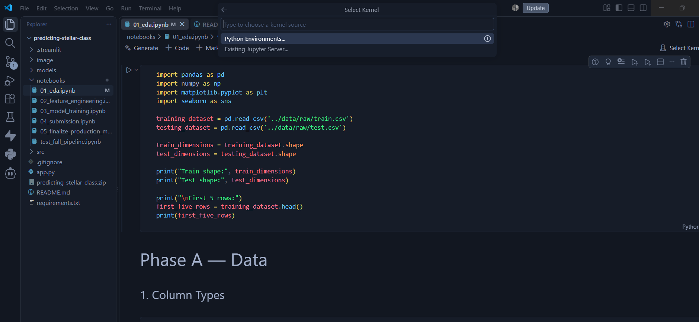

# 📦 Project Setup Instructions

## 1. Clone the Repository

```bash
git clone https://github.com/Niwarthana00/predicting-stellar-class.git
cd predicting-stellar-class
```

---

## 2. Download the Dataset

Download the required CSV files from **Kaggle**.

Create a folder named **raw** and place all downloaded CSV files inside it.

Example project structure:

```
predicting-stellar-class/
│
├── data/
│   └── raw/
│       ├── train.csv
│       ├── test.csv
│       └── sample_submission.csv
│
├── notebooks/
├── models/
├── src/
├── app.py
└── requirements.txt
```

---

## 3. Create a Virtual Environment

Open **PowerShell** and run:

```powershell
python -m venv .venv
```

---

## 4. Activate the Virtual Environment

```powershell
.venv\Scripts\Activate.ps1
```

If PowerShell blocks the script, run:

```powershell
Set-ExecutionPolicy -Scope Process -ExecutionPolicy Bypass
```

Then activate the environment again:

```powershell
.venv\Scripts\Activate.ps1
```

---

## 5. Install Required Libraries

```bash
pip install -r requirements.txt
```

---

## 6. Open the Project in Visual Studio Code

Open the project folder using **Visual Studio Code**.

---

## 7. Select the Python Kernel

Open any notebook (`.ipynb`) file.

Click **Select Kernel** in the top-right corner.

Choose **Python Environments...**, then select the **.venv** environment created for this project.

> **Note:** Always select the project's virtual environment (`.venv`) before running the notebooks.

<p align="center">
  
</p>

---

## 8. Run the Application

```bash
streamlit run app.py
```

The application will start at:

```
http://localhost:8501
```

Open the URL in your browser if it does not open automatically.

---

# 🖥️ Software & Library Requirements

- Python >= 3.9
- Streamlit
- NumPy
- Pandas
- CatBoost
- LightGBM
- joblib
- huggingface_hub

All required libraries are listed in **requirements.txt**.

---

# 📖 Additional Information

### Model Bundle

The pre-trained model (`production_bundle.pkl`) is hosted on Hugging Face.

The first time the application runs, the model is automatically downloaded using `hf_hub_download` and cached locally.

### Feature Groups

The application groups features into:

- Astrometry
- Photometry
- Colour Indices
- Band Statistics
- Redshift
- Encodings

Binary features such as:

- `is_high_z`
- `is_star_z`
- `is_redshift_zero`
- `is_very_high_z`
- `is_negative_z`

are displayed as checkboxes in the application.

### Model Explainability

The application provides SHAP explanations, including:

- Global feature importance
- Local SHAP contribution plots

These help explain why a particular stellar class was predicted.

### Running Offline

After the first execution, the downloaded model is cached locally.

Therefore, the application can be run without an internet connection.

---

## 🚀 Enjoy exploring stellar classification with machine learning!